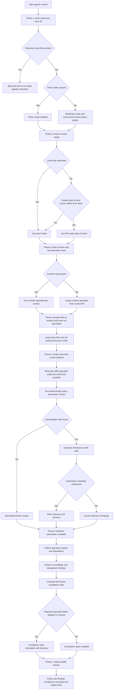

# Agentic Review Flow

This diagram visualizes what happens when a user runs `agentic-review`.

```mermaid
graph TD
    A[Start agentic review] --> B[Phase 1 verify setup and docs dir]
    B --> C{Required setup files present}
    C -- No --> D[Stop and ask to run setup agentic repository]
    C -- Yes --> E{Policy index present}
    E -- Yes --> F[Policy mode enabled]
    E -- No --> G[Bootstrap mode and recommend review policy builder]

    F --> H[Phase 2 resolve review target]
    G --> H
    H --> I{Local only requested}
    I -- Yes --> J[Use local mode]
    I -- No --> K{Usable base ref and branch differs from base}
    K -- Yes --> L[Use PR mode base to head]
    K -- No --> J

    J --> M[Phase 3 build module map and specialist roster]
    L --> M
    M --> N{Context map present}
    N -- Yes --> O[One module specialist per context]
    N -- No --> P[Single module specialist from context file]
    O --> Q[Route changed files to module and cross cut specialists]
    P --> Q
    Q --> R[Load policy files and set audit governance mode]

    R --> S[Phase 4 create canonical review artifacts]
    S --> T[Write plan diffs specialist output dir result and manifest]
    T --> U[Run deterministic policy automation checks]
    U --> V{Automatable rules found}
    V -- No --> W[Skip deterministic checks]
    V -- Yes --> X[Evaluate inheritance suffix rules]
    X --> Y{Automation metadata malformed}
    Y -- Yes --> Z[Mark unknown and continue]
    Y -- No --> AA[Convert failures to findings]
    W --> AB[Phase 5 dispatch specialists in parallel]
    Z --> AB
    AA --> AB

    AB --> AC[Collect specialist outputs and attestations]
    AC --> AD[Phase 6 consolidate and deduplicate findings]
    AD --> AE[Compute fail closed completion state]
    AE --> AF{Required specialist failed skipped or missing}
    AF -- Yes --> AG[Completion state incomplete with blockers]
    AF -- No --> AH[Completion state complete]

    AG --> AI[Phase 7 output quality checks]
    AH --> AI
    AI --> AJ[Finish with findings compliance coverage and artifact links]
```
