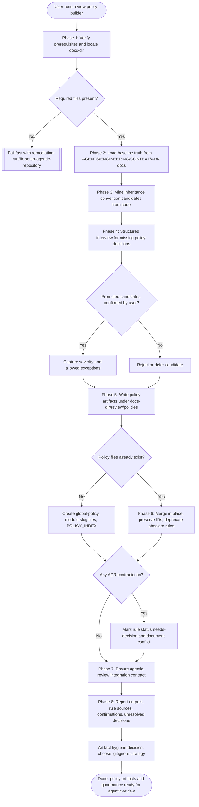

# Review Policy Builder Flow

This diagram visualizes what happens when a user runs `review-policy-builder`.

```mermaid
flowchart TD
    A([User runs review-policy-builder]) --> B[Phase 1: Verify prerequisites and locate docs-dir]
    B --> C{Required files present?}
    C -- No --> D[[Fail fast with remediation: run/fix setup-agentic-repository]]
    C -- Yes --> E[Phase 2: Load baseline truth from AGENTS/ENGINEERING/CONTEXT/ADR docs]
    E --> F[Phase 3: Mine inheritance convention candidates from code]
    F --> G[Phase 4: Structured interview for missing policy decisions]
    G --> H{Promoted candidates confirmed by user?}
    H -- Yes --> I[Capture severity and allowed exceptions]
    H -- No --> J[Reject or defer candidate]
    I --> K[Phase 5: Write policy artifacts under docs-dir/review/policies]
    J --> K
    K --> L{Policy files already exist?}
    L -- No --> M[Create global-policy, module-slug files, POLICY_INDEX]
    L -- Yes --> N[Phase 6: Merge in place, preserve IDs, deprecate obsolete rules]
    M --> O{Any ADR contradiction?}
    N --> O
    O -- Yes --> P[Mark rule status needs-decision and document conflict]
    O -- No --> Q[Phase 7: Ensure agentic-review integration contract]
    P --> Q
    Q --> R[Phase 8: Report outputs, rule sources, confirmations, unresolved decisions]
    R --> S[Artifact hygiene decision: choose .gitignore strategy]
    S --> T([Done: policy artifacts and governance ready for agentic-review])
```
